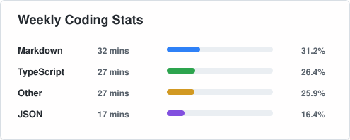
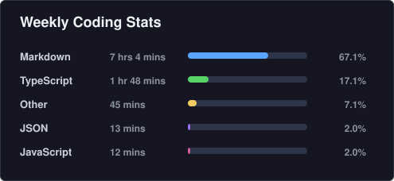
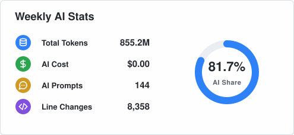
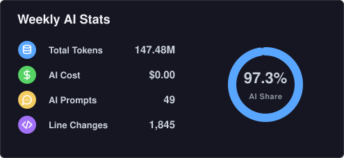
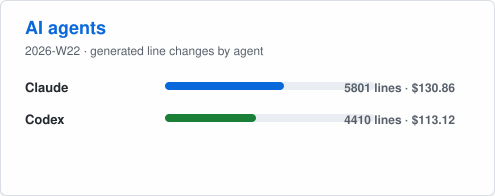

# Dev Stats

> 将 WakaTime 编程统计归档到本仓库，并生成可嵌入 GitHub README 的 SVG 卡片，展示语言编程时间和 AI 编程指标。

[English](./README.md) | [中文](./README-zh.md)

## 预览

| 浅色 | 深色 |
|:---:|:---:|
|  |  |
|  |  |
|  |  |

## 什么是 Dev Stats？

Dev Stats 是一个轻量级工具，用于将你的 WakaTime 每周编程统计归档到本仓库，并生成精美的 SVG 卡片供 GitHub README 使用。

它追踪以下指标：

- **语言编程时间** — 每种编程语言的使用时长
- **AI 编程指标** — token 用量、prompt 次数、会话数，以及 AI 与人工编程占比
- **AI Agent 活动** — 每个 Agent（Claude、Codex 等）的代码变更行数和费用

所有数据按周归档为 JSON 文件，即使免费 WakaTime 账户的历史数据过期，你也不会丢失任何统计记录。

## 功能特性

- 📊 每周数据归档为结构化 JSON（`data/YYYY/MM/YYYY-WW.json`）
- 🎨 六种 SVG 卡片变体（3 种卡片类型 × 2 种主题：浅色 & 深色）
- 🔄 通过 GitHub Actions 自动每日更新
- 📱 本地 HTML 预览，方便快速查看
- 🧪 完整的测试覆盖

## 安装使用

### 1. 获取 WakaTime API Key

1. 如果还没有账号，请先在 [WakaTime](https://wakatime.com/) 注册。
2. 前往 [WakaTime 个人资料设置](https://wakatime.com/settings/profile)，确保勾选了 **Display coding activity publicly**（这样 API 才能读取你的统计数据）。
3. 前往 [WakaTime API Key 设置页面](https://wakatime.com/settings/api-key)，复制你的 API Key。

### 2. 本地开发

```bash
npm install
cp .env.example .env
```

在 `.env` 中添加你的 WakaTime API Key：

```text
WAKATIME_API_KEY=你的API密钥
```

### 3. GitHub Actions（自动更新）

1. 进入仓库的 **Settings > Secrets and variables > Actions** 页面。
2. 点击 **New repository secret**，添加：
   - Name: `WAKATIME_API_KEY`
   - Secret: 第 1 步获取的 WakaTime API Key
3. 工作流每天 UTC 01:18（北京时间 09:18）自动运行。
4. 也可以在 **Actions** 页面手动触发。

## 常用命令

```bash
npm test              # 运行测试
npm run lint          # 代码检查
npm run format:check  # 格式检查
npm run build         # 编译 TypeScript
npm run update        # 拉取 WakaTime 数据并生成产物
npm run preview       # 使用测试数据生成预览（无需 API Key）
```

## 在 README 中使用

在任意仓库的 README 中嵌入卡片：

```md


```

深色主题：

```md


```

## 项目文档

- [项目上下文](docs/context/project-context.md)
- [WakaTime API 研究](docs/research/wakatime-api-research.md)
- [开发计划](docs/plan/development-plan.md)

## 开源协议

MIT
