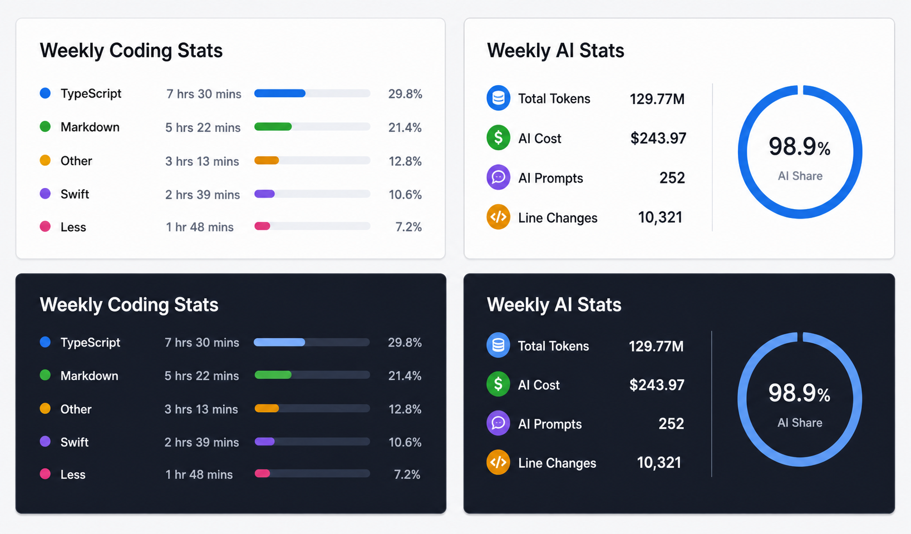

# Dev Stats

> Archive WakaTime coding stats and render GitHub README SVG cards for language coding time and AI coding metrics.

[English](./README.md) | [中文](./README-zh.md)

## Preview



Generated SVG cards:

|                         Light                          |                               Dark                               |
| :----------------------------------------------------: | :--------------------------------------------------------------: |
|  |  |
|            |            |

## What is Dev Stats?

Dev Stats is a lightweight tool that archives your weekly WakaTime coding statistics into this repository and generates beautiful SVG cards for your GitHub README.

It tracks:

- **Language coding time** — time spent in each programming language
- **AI coding metrics** — total tokens, AI cost, prompts, line changes, and AI share

All data is archived weekly as JSON, so you never lose historical stats even after your free WakaTime account's retention period expires.

## Features

- 📊 Weekly data archival as structured JSON (`data/YYYY/MM/YYYY-WW.json`)
- 🎨 Four SVG card variants (2 card types × 2 themes: light & dark)
- 🔄 Automated daily updates via GitHub Actions
- 📱 Local HTML preview for quick inspection
- 🧪 Full test coverage

## Setup

### 1. Get WakaTime API Key

1. Sign up at [WakaTime](https://wakatime.com/) if you haven't already.
2. Go to your [WakaTime Profile Settings](https://wakatime.com/settings/profile) and make sure **Display coding activity publicly** is checked (this allows the API to read your stats).
3. Go to [WakaTime API Key Settings](https://wakatime.com/settings/api-key) and copy your API key.

### 2. Local Development

```bash
npm install
cp .env.example .env
```

Add your WakaTime API key to `.env`:

```text
WAKATIME_API_KEY=your_key_here
```

### 3. GitHub Actions (Automated Updates)

1. Go to your repository **Settings > Secrets and variables > Actions**.
2. Click **New repository secret** and add:
   - Name: `WAKATIME_API_KEY`
   - Secret: your WakaTime API key from step 1
3. The workflow will run daily at UTC 01:18 (Beijing time 09:18).
4. You can also trigger it manually from the **Actions** tab.

## Commands

```bash
npm test              # Run tests
npm run lint          # Lint code
npm run format:check  # Check formatting
npm run build         # Build TypeScript
npm run update        # Fetch WakaTime data and generate artifacts
npm run preview       # Generate preview with test fixtures (no API key needed)
```

## GitHub README Usage

Embed cards in any repository's README:

```md


```

Dark theme:

```md


```

## Docs

- [Project context](docs/context/project-context.md)
- [WakaTime API research](docs/research/wakatime-api-research.md)
- [Development plan](docs/plan/development-plan.md)

## License

MIT
