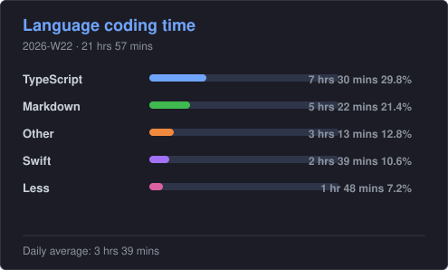
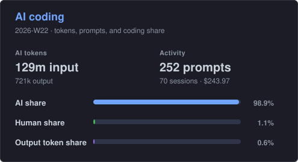
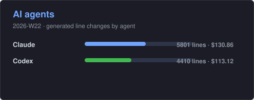

# Dev Stats

> Archive WakaTime coding stats into this repository and render GitHub README-friendly SVG cards for language coding time and AI coding metrics.

[English](#english) | [中文](#中文)

---

## English

### What is Dev Stats?

Dev Stats is a lightweight tool that archives your weekly WakaTime coding statistics into this repository and generates beautiful SVG cards for your GitHub README. It tracks:

- **Language coding time** — how much time you spend in each programming language
- **AI coding metrics** — tokens, prompts, sessions, and AI vs human coding share
- **AI agent activity** — line changes and costs per AI agent (Claude, Codex, etc.)

All data is archived weekly as JSON files, so you never lose historical stats even after your free WakaTime account's retention period expires.

### Preview

**Default theme:**


**Tokyo Night theme:**





### Features

- 📊 Weekly data archival as structured JSON (`data/YYYY/MM/YYYY-WW.json`)
- 🎨 Six SVG card variants (3 card types × 2 themes)
- 🔄 Automated daily updates via GitHub Actions
- 🌙 Tokyo Night dark theme support
- 📱 Local HTML preview for quick inspection
- 🧪 Full test coverage with TDD approach

### Setup

```bash
npm install
cp .env.example .env
```

Add your WakaTime API key to `.env`:

```text
WAKATIME_API_KEY=your_key_here
```

### Commands

```bash
npm test              # Run tests
npm run lint          # Lint code
npm run format:check  # Check formatting
npm run build         # Build TypeScript
npm run update        # Fetch WakaTime data and generate artifacts
npm run preview       # Generate preview with test fixtures (no API key needed)
```

### GitHub README Usage

After the scheduled workflow generates SVG files, embed cards in any repository's README:

```md


```

For the dark theme:

```md


```

### GitHub Actions Setup

1. Create a repository secret named `WAKATIME_API_KEY` with your WakaTime API key
2. The workflow runs daily at UTC 01:18 (Beijing time 09:18)
3. You can also trigger it manually from the Actions tab

---

## 中文

### 什么是 Dev Stats？

Dev Stats 是一个轻量级工具，用于将你的 WakaTime 每周编程统计归档到本仓库，并生成精美的 SVG 卡片供 GitHub README 使用。它追踪：

- **语言编程时间** — 你在每种编程语言上花费的时间
- **AI 编程指标** — token 用量、prompt 次数、会话数，以及 AI 与人工编程占比
- **AI Agent 活动** — 每个 AI Agent（Claude、Codex 等）的代码变更行数和费用

所有数据按周归档为 JSON 文件，即使免费 WakaTime 账户的历史数据过期，你也不会丢失任何统计记录。

### 功能特性

- 📊 每周数据归档为结构化 JSON（`data/YYYY/MM/YYYY-WW.json`）
- 🎨 六种 SVG 卡片变体（3 种卡片类型 × 2 种主题）
- 🔄 通过 GitHub Actions 自动每日更新
- 🌙 支持 Tokyo Night 暗色主题
- 📱 本地 HTML 预览，方便快速查看
- 🧪 完整的测试覆盖，采用 TDD 方式开发

### 安装使用

```bash
npm install
cp .env.example .env
```

在 `.env` 中添加你的 WakaTime API Key：

```text
WAKATIME_API_KEY=你的API密钥
```

### 常用命令

```bash
npm test              # 运行测试
npm run lint          # 代码检查
npm run format:check  # 格式检查
npm run build         # 编译 TypeScript
npm run update        # 拉取 WakaTime 数据并生成产物
npm run preview       # 使用测试数据生成预览（无需 API Key）
```

### 在 README 中使用

定时工作流生成 SVG 文件后，在任意仓库的 README 中嵌入卡片：

```md


```

使用暗色主题：

```md


```

### GitHub Actions 配置

1. 创建仓库 Secret，名称为 `WAKATIME_API_KEY`，值为你的 WakaTime API Key
2. 工作流每天 UTC 01:18（北京时间 09:18）自动运行
3. 也可以在 Actions 页面手动触发

---

## Project Docs

- [Current project context](docs/context/project-context.md)
- [WakaTime API research](docs/research/wakatime-api-research.md)
- [Development plan](docs/plan/development-plan.md)

## License

MIT
